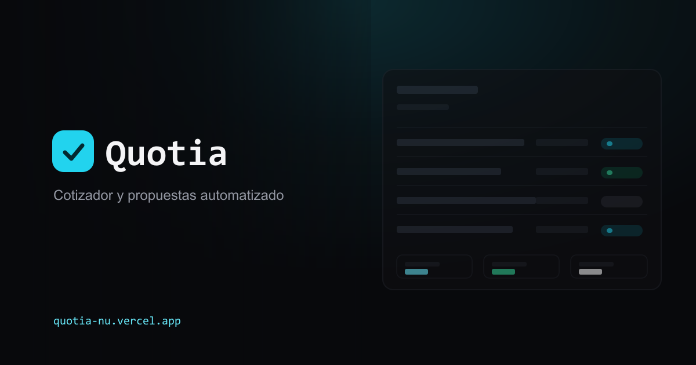

<p align="center">
  
</p>

# Quotia

Cotizador y gestor de propuestas para freelancers y pequeños negocios: crea una cotización, genérala en PDF, cóbrala con Stripe y da seguimiento a su estado, todo desde un solo panel.

**En producción:** [quotia-nu.vercel.app](https://quotia-nu.vercel.app)

## El problema

Cerrar un cliente casi nunca termina en la cotización — termina en una cadena de PDFs armados a mano en Word o Canva, links de pago copiados y pegados por WhatsApp, y una hoja de cálculo paralela para no perder el hilo de quién pagó y quién no. Quotia reemplaza ese proceso manual por un flujo de un solo lugar: llenas el formulario una vez y el sistema se encarga del documento, el cobro y el seguimiento.

## Funcionalidades (v1)

- **Formulario de cotización** — datos del cliente, ítems con cantidad/precio unitario, y cálculo automático de subtotal, impuestos y total.
- **Generación de PDF on-demand** — un PDF profesional y neutro (pensado para el cliente final, no para la marca del negocio) generado al vuelo a partir de los datos guardados, sin almacenarlo en ningún storage.
- **Cobro con Stripe** — genera un link de Stripe Checkout ligado a la cotización con un clic; un webhook marca automáticamente la cotización como pagada en cuanto se completa el pago.
- **Panel de seguimiento** — listado de cotizaciones con filtro por estado (borrador / enviada / pagada), tarjetas de resumen (total de cotizaciones, pendiente de cobro, cobrado), y acceso directo a descargar el PDF o generar/copiar el link de pago desde cada fila.

Autenticación de un solo usuario (sin registro público) protege todo el panel y el formulario detrás de login.

## Stack técnico

| Capa | Tecnología |
|---|---|
| Frontend + backend | Next.js 16 (App Router, Server Actions, Route Handlers) + TypeScript |
| Estilos | Tailwind CSS v4 |
| Base de datos | Firebase Firestore (Admin SDK) |
| Autenticación | Firebase Auth (email/password) + session cookies verificadas server-side |
| PDF | `@react-pdf/renderer`, generado en runtime dentro de un Route Handler |
| Pagos | Stripe Checkout Sessions + webhooks |
| Despliegue | Vercel |

### Notas de arquitectura

- Todo el acceso a Firestore y Firebase Auth pasa por el Admin SDK del lado del servidor — no hay SDK cliente de Firebase expuesto al navegador, así que no depende de reglas de seguridad de Firestore para proteger los datos.
- El middleware (`proxy.ts`) hace un chequeo rápido de la cookie de sesión en el edge; la verificación criptográfica real de la sesión ocurre en cada página, server action y route handler protegidos, donde sí corre en runtime Node.js.
- El PDF se genera al vuelo en cada descarga a partir del estado actual de la cotización en Firestore, en vez de guardarse como archivo — refleja siempre los datos más recientes y no necesita gestión de storage.

## Correr el proyecto localmente

```bash
npm install
cp .env.local.example .env.local   # completar con tus credenciales de Firebase/Stripe
npm run dev
```

Variables de entorno necesarias (ver `.env.local.example` para el detalle de cada una): credenciales del service account de Firebase Admin (en base64), la API key pública de Firebase, y las claves de Stripe (secret key + webhook signing secret).
